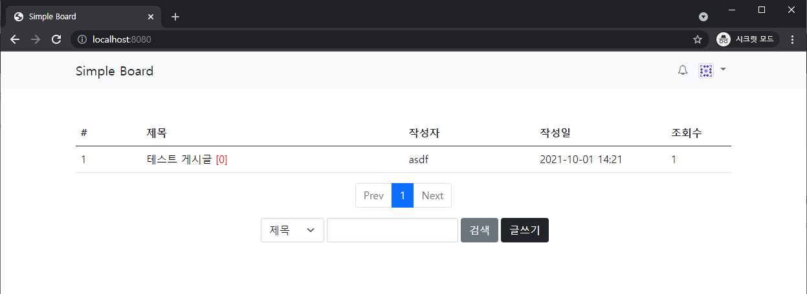

[![Contributors][contributors-shield]][contributors-url]
[![Forks][forks-shield]][forks-url]
[![Stargazers][stars-shield]][stars-url]
[![Issues][issues-shield]][issues-url]
[![MIT License][license-shield]][license-url]
[![LinkedIn][linkedin-shield]][linkedin-url]

# Simple Board

A simple board made using spring boot



## Description

* Member registration, withdrawal, information modification
* Post write, edit, delete
* Comment write, edit, delete

## Getting Started

### Development Environments
* Java 11
* Spring boot 2.5.3

### Installation
1. Clone the repo
   ```sh
   git clone https://github.com/dev-aiden/simple-board.git
   ```
2. Move to src\main\resources\static and install NPM packages
   ```sh
   npm install
   ```
4. Move to the project root directory and run
   ```sh
   (Windows) gradlew.bat build
   (Mac) ./gradlew build

## Help

Email authentication through the URI displayed in the log after signing up.

```
send email : /check-email-token?token=29a37deb-12bf-476e-912e-7d1959163a12&email=asdf@email.com
```

## Authors

Gwangyong Jeong([@dev-aiden](https://github.com/dev-aiden)) / tyjk32@gmail.com

Project Link: [https://github.com/dev-aiden/simple-board](https://github.com/dev-aiden/simple-board)


## Version History

* 1.0
    * Initial Release

## License

This project is licensed under the MIT License - see the LICENSE file for details

[contributors-shield]: https://img.shields.io/github/contributors/dev-aiden/simple-board.svg?style=for-the-badge
[contributors-url]: https://github.com/dev-aiden/simple-board/graphs/contributors
[forks-shield]: https://img.shields.io/github/forks/dev-aiden/simple-board.svg?style=for-the-badge
[forks-url]: https://github.com/dev-aiden/simple-board/network/members
[stars-shield]: https://img.shields.io/github/stars/dev-aiden/simple-board.svg?style=for-the-badge
[stars-url]: https://github.com/dev-aiden/simple-board/stargazers
[issues-shield]: https://img.shields.io/github/issues/dev-aiden/simple-board.svg?style=for-the-badge
[issues-url]: https://github.com/dev-aiden/simple-board/issues
[license-shield]: https://img.shields.io/github/license/dev-aiden/simple-board.svg?style=for-the-badge
[license-url]: https://github.com/dev-aiden/simple-board/blob/master/LICENSE
[linkedin-shield]: https://img.shields.io/badge/-LinkedIn-black.svg?style=for-the-badge&logo=linkedin&colorB=555
[linkedin-url]: https://www.linkedin.com/in/gwangyong-jeong/
